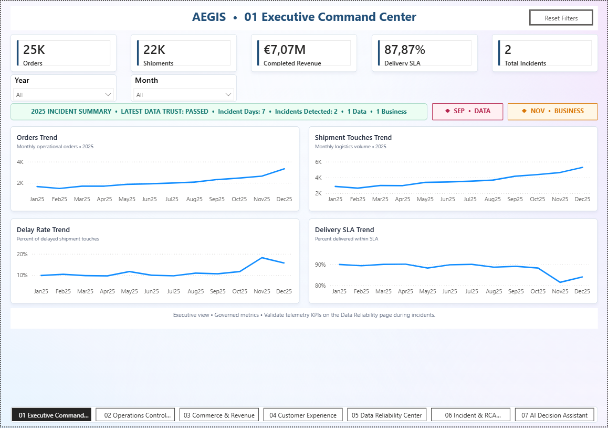
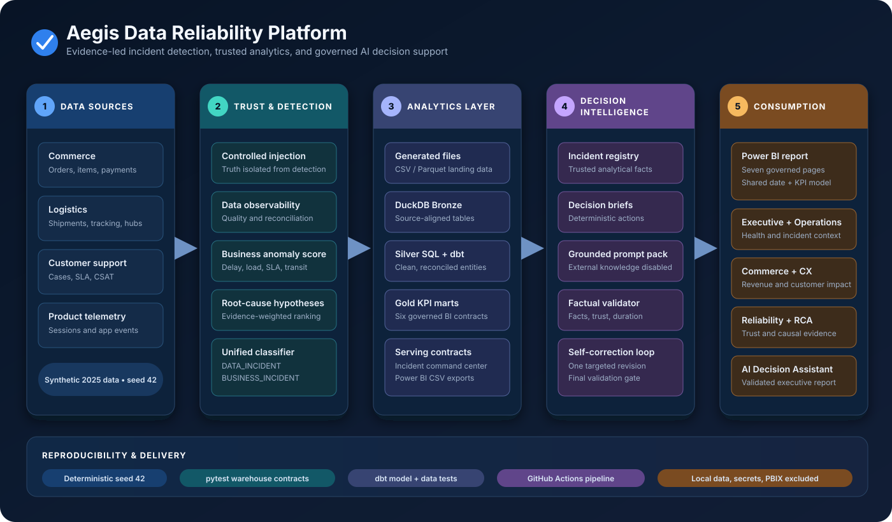
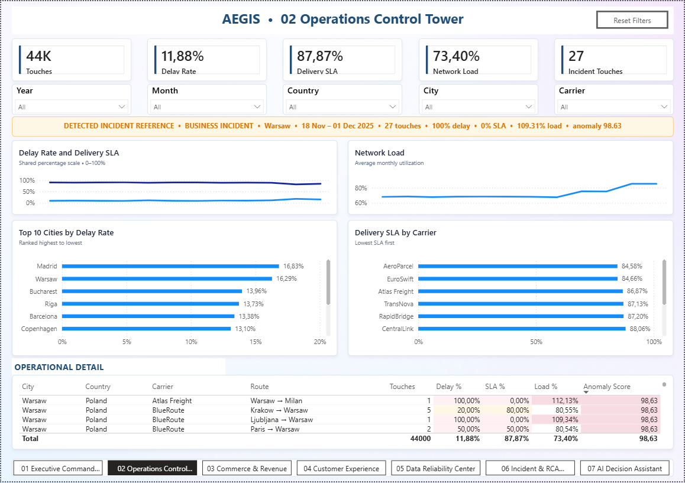
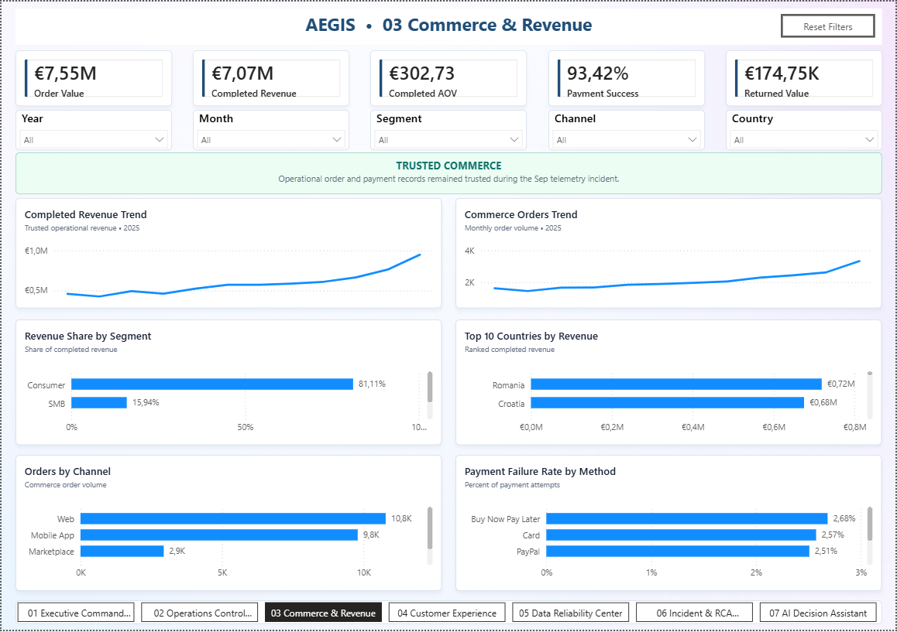
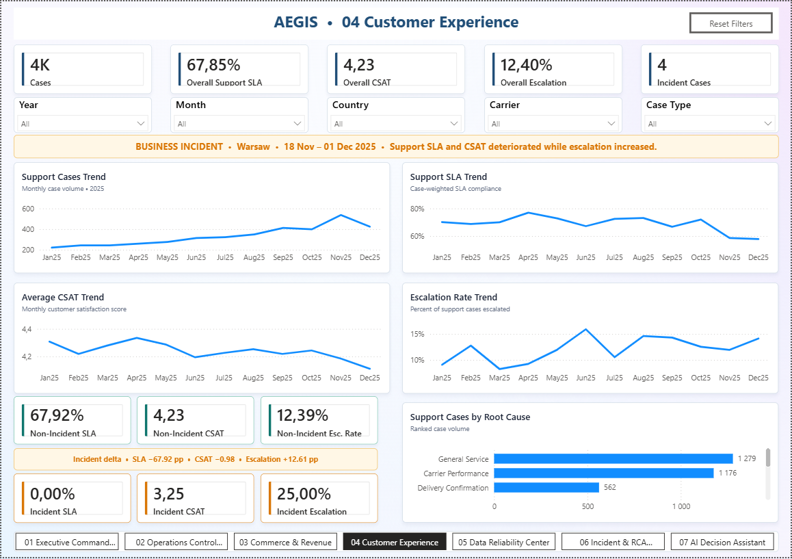
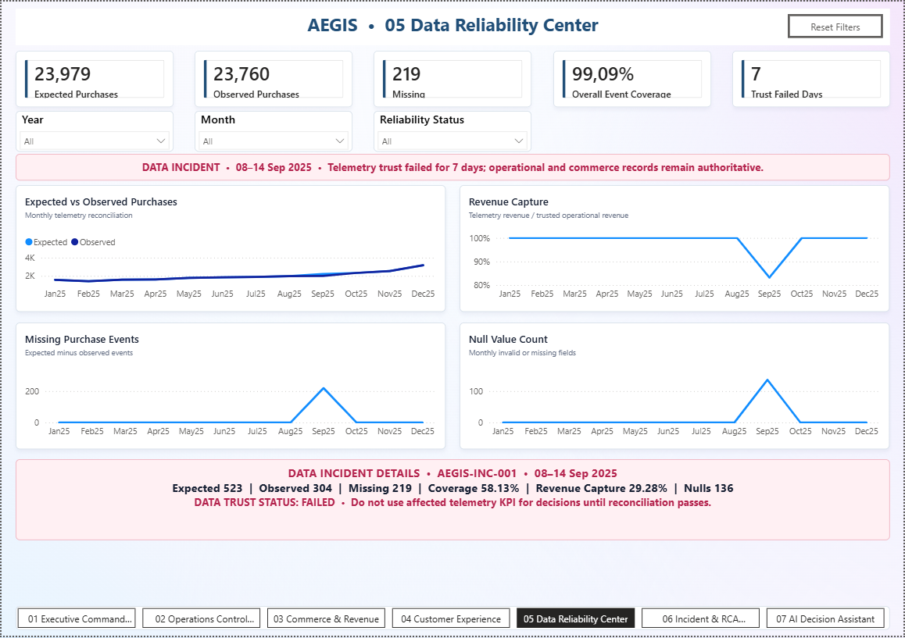
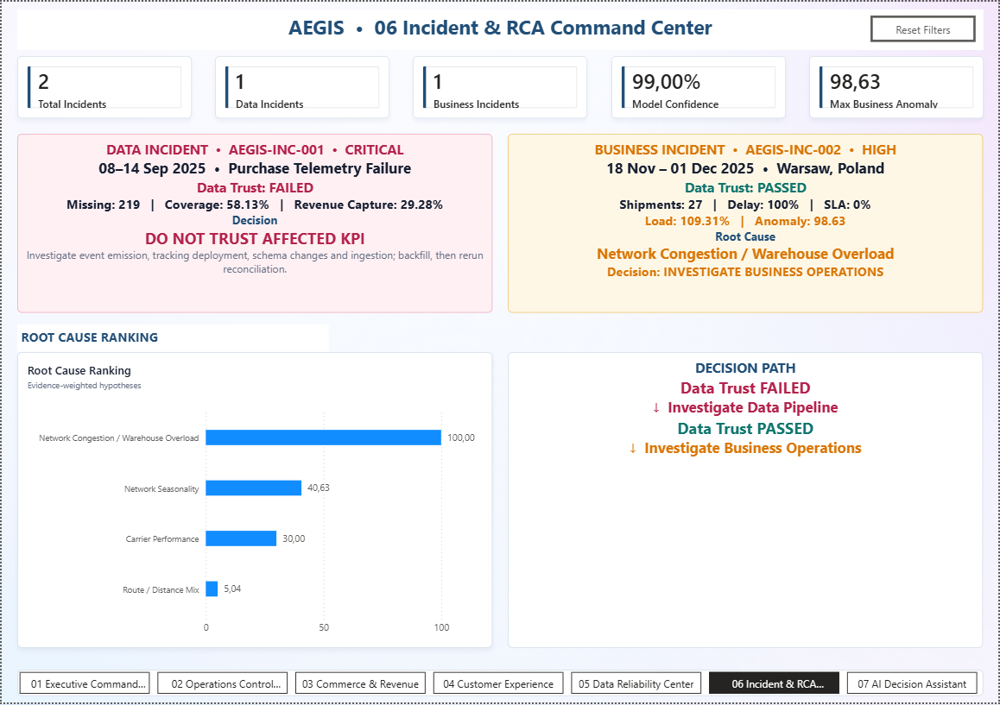
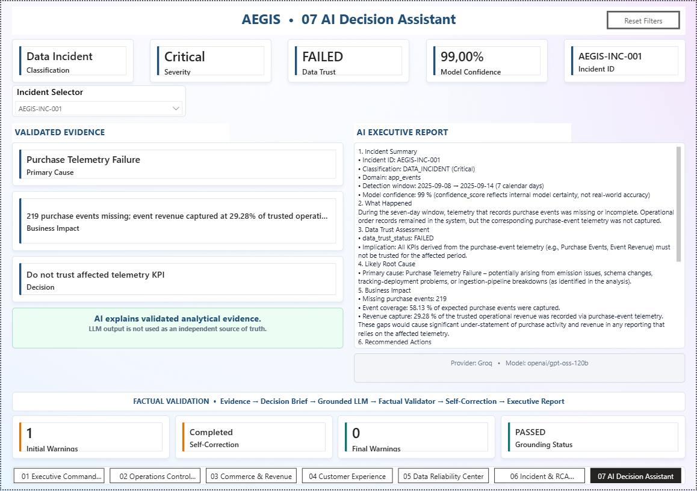

<h1 align="center">Aegis Data Reliability Platform</h1>

  An end-to-end analytics engineering portfolio project that separates bad data from real business incidents, explains root-cause evidence, and turns governed facts into executive decisions.

  
  
  
  
  
  

  

## Overview

Aegis simulates a European commerce and logistics platform, injects controlled data and operational failures, and then detects them without reading the ground-truth incident file. The project brings together data generation, observability, reconciliation, anomaly scoring, root-cause analysis, incident classification, DuckDB warehousing, dbt models, contract tests, governed AI reporting, and a seven-page Power BI product.

The central design question is:

> Is a KPI moving because the business changed, or because the data cannot be trusted?

Aegis answers that question before producing recommendations:

- <strong>DATA_INCIDENT</strong>: data trust failed; affected telemetry KPIs must be paused.
- <strong>BUSINESS_INCIDENT</strong>: data trust passed; the operational anomaly is real and action can be taken.

## Key results

All values below are reproducible from the deterministic <code>dev</code> configuration and are asserted by the analytical contracts or captured in the governed evidence package.

| Area | Verified result |
|---|---|
| Dataset | 25,000 orders, 22,000 shipments, 150,000 tracking events, 4,000 support cases |
| Commerce trust | 25,000 orders reconciled with 0 payment mismatches |
| Data incident | 7 affected days; 219 missing purchase events; 58.13% event coverage; 29.28% revenue capture |
| Business incident | Warsaw hub; 27 shipment touches; 100% delay rate; 109.31% average network load |
| Customer impact | 4 incident support cases; 0% support SLA; 3.25 average CSAT |
| Incident registry | 2 incidents: 1 data incident and 1 business incident, each with an explicit trust state |
| Governed AI | Factual validator caught a 6-vs-7-day duration error; one self-correction reduced warnings from 1 to 0 |

These are synthetic evaluation results, not production performance claims.

## What the project demonstrates

- Deterministic multi-domain data generation with a fixed seed and two scale profiles.
- Controlled incident injection while keeping ground truth isolated from the detection path.
- Data quality controls for completeness, uniqueness, freshness, volume, nulls, and reconciliation.
- Multi-metric operational anomaly scoring across delay, load, SLA, and transit-time changes.
- Evidence-weighted root-cause hypotheses and a unified incident registry.
- Bronze, Silver, and Gold analytical layers in DuckDB, with an additional dbt modeling and test layer.
- Weighted KPI modeling and a disconnected incident-grain table for Power BI.
- Evidence-only decision briefs, grounded LLM prompts, factual validation, and targeted self-correction.
- Reproducible CI that rebuilds the pipeline, runs dbt models/tests, and verifies warehouse contracts.

## Architecture

  

### Data flow

| Layer | Responsibility | Main outputs |
|---|---|---|
| Generate | Create commerce, logistics, support, and product-event data | Local CSV/Parquet datasets |
| Detect | Run quality controls, reconciliation, business anomaly scoring, RCA, and classification | Quality controls, anomaly evidence, incident registry |
| Model | Load DuckDB Bronze, transform Silver entities, and build Gold KPI marts | <code>data/warehouse/aegis.duckdb</code> |
| Decide | Build deterministic briefs and evidence-constrained prompt packs | Local incident briefs and prompt packs |
| Consume | Export governed marts and visualize executive, operational, reliability, RCA, and AI views | Power BI-ready CSVs and report pages |

The default pipeline contains 20 deterministic steps and does not require an external AI provider.

## Power BI report

The report uses a shared date dimension, weighted percentage measures, six daily/domain marts, and a disconnected incident command-center table at incident grain. Detailed modeling guidance and DAX measures are documented in [powerbi/POWER_BI_MODEL.md](powerbi/POWER_BI_MODEL.md).

| 01 Executive Command Center | 02 Operations Control Tower |
|---|---|
|  |  |

| 03 Commerce & Revenue | 04 Customer Experience |
|---|---|
|  |  |

| 05 Data Reliability Center | 06 Incident & RCA Command Center |
|---|---|
|  |  |

  <strong>07 AI Decision Assistant</strong> 
  

The Power BI binary and local project workspace are intentionally excluded from Git. Screenshots and the semantic-model documentation provide a lightweight, reviewable portfolio representation.

## AI grounding and self-correction

AI is optional and is not used as an independent source of truth.

1. The deterministic pipeline creates an incident registry and decision brief.
2. A prompt pack exposes only the validated evidence required for that incident.
3. Guardrails prohibit external facts, invented metrics, invented causes, and claims that remediation already worked.
4. The factual validator checks required facts, data-trust language, confidence framing, incident duration, unsupported numbers, and action claims.
5. The Groq execution path performs one targeted correction when warnings are found, then validates the revised report again.

The included evaluation case demonstrates this loop: the initial report described a 7-day incident as 6 days; validation detected the mismatch, the correction pass fixed it, and final validation returned zero warnings.

The OpenAI runner also produces grounded reports and validation warnings. The current one-pass self-correction implementation is in <code>src/ai/run_decision_assistant_groq.py</code>.

## Setup

### Prerequisites

- Python 3.12 or newer
- Power BI Desktop only if you want to recreate the report from the exported data and model guide
- An API key only if you explicitly run a live AI provider

### Install

From the repository root:

~~~powershell
python -m venv .venv
.venv\Scripts\Activate.ps1
python -m pip install --upgrade pip
python -m pip install -r requirements.txt
~~~

On macOS or Linux, activate the environment with <code>source .venv/bin/activate</code>.

No secrets are required for the deterministic pipeline. For optional live AI calls, create a local environment file:

~~~powershell
Copy-Item .env.example .env
~~~

Then add either <code>GROQ_API_KEY</code> or <code>OPENAI_API_KEY</code>. The local <code>.env</code> file is ignored by Git.

## Run

### Full deterministic pipeline

~~~powershell
python -m src.pipeline.run_all
~~~

Useful controls:

~~~powershell
# Show every pipeline step
python -m src.pipeline.run_all --list

# Resume from a numbered step
python -m src.pipeline.run_all --from-step 13

# Run the complete pipeline and the optional live Groq report step
python -m src.pipeline.run_all --with-ai
~~~

To use the OpenAI report path after prompt packs have been generated:

~~~powershell
python -m src.ai.run_decision_assistant
~~~

### Export for Power BI

Run the pipeline first, then export the governed Gold tables and date dimension:

~~~powershell
python -m src.warehouse.export_powerbi
python -m src.warehouse.export_powerbi_date
~~~

The generated CSV files are written to <code>powerbi/data/</code> and remain local.

## dbt

The repository includes a separate dbt project for reviewable SQL lineage and model-level tests. It reads the DuckDB Bronze tables created by the deterministic pipeline.

~~~powershell
python -m src.pipeline.run_all
dbt build --profiles-dir dbt
~~~

To inspect the generated lineage locally:

~~~powershell
dbt docs generate --profiles-dir dbt
dbt docs serve --profiles-dir dbt
~~~

The dbt project covers source tests, accepted-value checks, uniqueness/not-null contracts, Silver entities, and daily Gold commerce, logistics, and support marts.

## Testing and CI

Run the regression suite against the generated warehouse:

~~~powershell
pytest -v
~~~

Optional coverage:

~~~powershell
pytest --cov=src --cov-report=term-missing
~~~

The [GitHub Actions workflow](.github/workflows/ci.yml) runs on pushes and pull requests to <code>main</code>. It:

1. installs the Python and dbt dependencies;
2. rebuilds the deterministic pipeline from scratch;
3. runs <code>dbt build</code> with model and data tests;
4. executes the warehouse and Gold-layer regression contracts.

The Python tests verify schema inventory, Bronze row counts, key uniqueness, payment and purchase-event reconciliation, the injected incident windows, Gold KPI totals, and the final two-incident command-center contract.

## Repository structure

~~~text
.
├── .github/workflows/ci.yml       # end-to-end CI
├── config/settings.yaml           # seed, scale, thresholds, local paths
├── dbt/                           # staging, Silver, Gold, and dbt tests
├── docs/
│   ├── architecture.svg           # platform architecture
│   └── screenshots/power-bi/      # seven curated report screenshots
├── powerbi/POWER_BI_MODEL.md      # model relationships and DAX guidance
├── sql/
│   ├── silver/                    # core SQL transformations
│   └── gold/                      # governed analytical marts
├── src/
│   ├── generate/                  # synthetic source generation
│   ├── incidents/                 # injection and classification
│   ├── quality/                   # data observability controls
│   ├── anomaly/                   # operational anomaly scoring
│   ├── rca/                       # root-cause hypothesis ranking
│   ├── decision/                  # deterministic decision briefs
│   ├── ai/                        # grounding, validation, provider runners
│   ├── warehouse/                 # DuckDB layers and Power BI exports
│   └── pipeline/run_all.py        # pipeline orchestration
├── tests/                         # warehouse and Gold contracts
├── .env.example                   # secret-free optional AI configuration
├── dbt_project.yml
├── pyproject.toml
└── requirements.txt
~~~

Generated datasets, databases, logs, AI responses, QA captures, local Power BI projects, PBIX/PBIT binaries, caches, and environment files are excluded through <code>.gitignore</code>.

## Limitations

- All data and incidents are synthetic and intentionally shaped for a deterministic portfolio evaluation.
- Root-cause scores are evidence-weighted hypotheses, not proof of causality.
- The platform runs as a local batch workflow on DuckDB; it does not include production orchestration, streaming ingestion, access control, alert routing, or cloud deployment.
- The factual validator is a rules-based safeguard, not a formal guarantee that every possible hallucination will be detected.
- Live LLM wording and model availability can vary by provider; the core pipeline remains provider-independent.
- Power BI screenshots are static, and the binary report is intentionally not versioned in this repository.
- Reported confidence is internal to the synthetic Aegis framework and should not be interpreted as real-world model accuracy.
